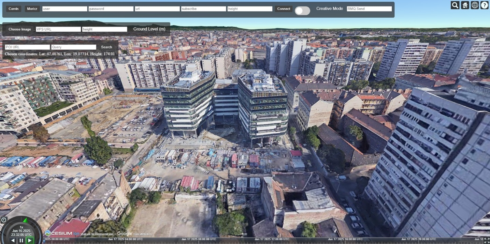

# Cesium Viewer

This viewer is created to showcase and enhance the experience of the OpenVPS, WebXR applications and the Points of Interest collection service. It is a Cesium based visualizer that uses Google Earth’s models for buildings, terrain and surface of the globe.

To run the application some preparations are required

## Get a Cesium Token

Visit the [Cesium ion](https://ion.cesium.com/signin/) website and register. At the Access Tokens tab you will be able to find your Default Token. Paste this into the CesiumToken variable in index.html. In the viewer we are using Google Photorealistic 3D Tiles. To get the id of the tileset go to My Assets and choose Google Photorealistic 3D Tiles. You will be able to see the id there. Paste this into the tileID variable in index.html.

## Set the vite.config.js file

Use the port you want the application to run on. If you are deploying it set the external url.

## Run locally

npm install
npm run dev --  --host --port 8049

## Run with docker

TAG=oarc_cesium_viewer
docker build -t $TAG
docker run $TAG -p 8049:8044

You can set the port to what best fits you requirements

# Using the Cesium viewer

## OpenVPS

In the VPS URL text field type in the URL where the VPS runs. The height parameter is to set the height of the result above sea level. The Choose Image button will open the file explorer where you can upload a query image that will be used for localization. Keep in mind the image MUST contain exif data otherwise it will not give any results. Once the result comes back from the OpenVPS the viewer will go into a first person view of where the image was taken. If the height parameter was not set or below ground the POV will be on the ground.

You can set it up by using the official [OpenVPS](https://github.com/OpenArCloud/openvps) code.

## Point of Interes Collection Service

In the POI URL field type in where the service runs. Type in the query what you are looking for. If you click on the ground in the viewer it will set the coordinates of the click as the center of the search. It will search within 200 meters of the chosen coordinates.

You can set up the service with the help of the [OSCP-POI-service](https://github.com/OpenArCloud/oscp-poi-service) repository.

## Displaying users

We can show the position and orientation of users in the Cesium viewer. We get the information through the RabbitMQ message broker. If you want to set up your RMQ exchange visit the official [website](https://www.rabbitmq.com/). 

Once you have set up the exchange you can connect to it in the viewer filling out the form and clicking Connect.
Use [spARcl](https://github.com/OpenArCloud/sparcl) to localize and view your position in the viewer. In spARcl set the exchange to yours.

## Sending Waypoints
If you click the toggle switch, you can send waypoints through RMQ to WebXR applications in our case spARcl. Type in the exchange you want to send data to. Click on the ground and a pin will appear both in the viewer and in spARcl at the same location.
