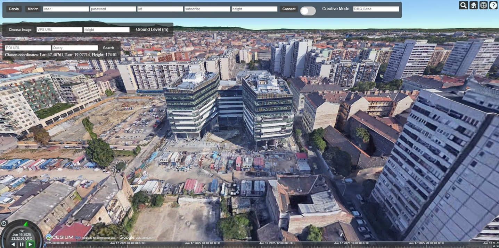

# Cesium Viewer

This viewer is created to showcase and enhance the experience of the OpenVPS, WebXR applications and the Points of Interest collection service. It is a Cesium based visualizer that uses Google Earth’s models for buildings, terrain and surface of the globe.



To run the application some preparations are required

## Get a Cesium Token

Visit the [Cesium ion](https://ion.cesium.com/signin/) website and register. At the Access Tokens tab you will be able to find your Default Token. Copy `.env.example` to `.env` and set `VITE_CESIUM_TOKEN` to this token (`.env` is gitignored, so it never gets committed). When running in Docker, pass it as a real environment variable instead, e.g. `docker run -e VITE_CESIUM_TOKEN=... ...`. In the viewer we are using Google Photorealistic 3D Tiles. To get the id of the tileset go to My Assets and choose Google Photorealistic 3D Tiles. You will be able to see the id there. Paste this into the tileID variable in index.html.


## Set the vite.config.js file

In `vite.config.js`, edit your port number and add your domain name to the allowed hosts.

## Config files

Before building the application or Docker image, create or edit these configuration files in the project root:

- `connect.json` for the default VPS and POI URLs and RabbitMQ connection details. See [Configuring service connections](#configuring-service-connections) for the fields and an example.
- `locations.json` for the viewer locations and their camera positions. See [Configuring locations](#configuring-locations) for the required fields.

## Run locally

Copy `.env.example` to `.env` and set `VITE_CESIUM_TOKEN` to your Cesium ion access token.

```
npm install
npm run dev --  --host --port YOUR_EXTERNAL_PORT
```
## Run with docker

The container uses the same `vite.config.js` as local development. Before building with either Docker method, add your external domain to `server.allowedHosts` in that file, then rebuild the image so the change is included.

Docker does not load `.env` automatically when you run `docker build`. From the project directory, export the values from `.env` and pass the Cesium token as a build argument:

```
TAG=oscp/cesium-viewer
set -a
. ./.env
set +a
docker build --build-arg VITE_CESIUM_TOKEN -t "$TAG:latest" .
docker run --restart unless-stopped -p YOUR_EXTERNAL_PORT:8044 -d "$TAG:latest"
```
You can set the port to what best fits you requirements

## Run with docker compose

The container uses the same `vite.config.js` as local development. Before building with either Docker method, add your external domain to `server.allowedHosts` in that file, then rebuild the image so the change is included.

Copy `.env.example` to `.env`, set `VITE_CESIUM_TOKEN`, and adjust `PORT` if needed. From the project directory, pass the file explicitly to Docker Compose and rebuild so the token is available to Vite:

```
docker compose --env-file .env up -d --build
(--force-recreate)
```

# Using the Cesium viewer

## Configuring locations

Selectable viewer locations are configured in `locations.json`. Each entry must
contain a name, coordinates, height, and camera orientation (`heading`,
`pitch`, and `roll`). The viewer only creates a location button for entries
whose `enabled` property is `true`; set it to `false` to keep a location in the
configuration without displaying it. Bari and Corvin are currently enabled.

## Configuring service connections

Edit `connect.json` in the project root to set the default service URLs and RabbitMQ connection settings. The viewer loads this file at startup and uses its values to prefill the connection fields when the connection toggle is enabled.

For example:

```json
{
	"vpsurl": "https://vps.example.com/localize/geopose",
	"rmquser": "your-rabbitmq-user",
	"rmqpassword": "your-rabbitmq-password",
	"rmqurl": "wss://rabbitmq.example.com/ws",
	"rmqtopic_geopose_update": "/exchange/your_exchange/geopose_update.#",
	"rmqtopic_waypoint": "/exchange/your_exchange/waypoint",
	"poiurl": "https://poi.example.com/locations"
}
```

Replace the example values with the endpoints, credentials, and topics for your services. Keep the file as valid JSON when editing it. Since `connect.json` is served to the browser, its contents are visible to anyone who can access the viewer; do not put sensitive credentials in a publicly deployed copy.

## OpenVPS

In the VPS URL text field type in the URL where the VPS runs. The height parameter is to set the height of the result above sea level. The Choose Image button will open the file explorer where you can upload a query image that will be used for localization. Keep in mind the image MUST contain exif data otherwise it will not give any results. Once the result comes back from the OpenVPS the viewer will go into a first person view of where the image was taken. If the height parameter was not set or below ground the POV will be on the ground.

You can set it up by using the official [OpenVPS](https://github.com/OpenArCloud/openvps) code.

## Point of Interes Collection Service

In the POI URL field type in where the service runs. Type in the query what you are looking for. If you click on the ground in the viewer it will set the coordinates of the click as the center of the search. It will search within 200 meters of the chosen coordinates.

You can set up the service with the help of the [OSCP-POI-service](https://github.com/OpenArCloud/oscp-poi-service) repository.

## Displaying users

We can show the position and orientation of users in the Cesium viewer. We get the information through the RabbitMQ message broker. If you want to set up your RMQ exchange visit the official [website](https://www.rabbitmq.com/).

Once you have set up the exchange you can connect to it in the viewer filling out the form and clicking Connect.
Use [spARcl](https://github.com/OpenArCloud/sparcl) to localize and view your position in the viewer. In spARcl set the exchange to yours.

## Sending Waypoints
If you click the toggle switch, you can send waypoints through RMQ to WebXR applications in our case spARcl. Type in the exchange you want to send data to. Click on the ground and a pin will appear both in the viewer and in spARcl at the same location.
